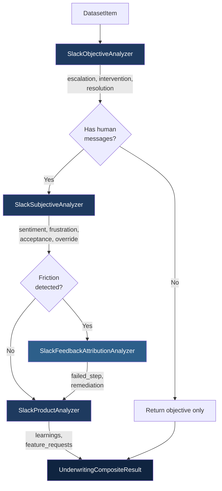

# Composite Orchestrator

<div style="background: linear-gradient(135deg, #1E3A5F 0%, #0F2440 100%); padding: 24px; border-radius: 12px; color: white; margin: 20px 0;">

<p style="margin: 0; font-size: 16px; line-height: 1.6;">
<strong>The "General Manager" — orchestrates all analyzers in strict dependency order.</strong> Manages context passing between stages, conditional execution of expensive analyses, and flattened sub-metric output for unified reporting.
</p>
</div>

<div class="at-a-glance">
<div class="at-a-glance__header">
<span class="at-a-glance__title">At a Glance</span>
<span class="at-a-glance__badge at-a-glance__badge--orchestrator">Orchestrator</span>
</div>
<div class="at-a-glance__body">
<div class="at-a-glance__item">
<span class="at-a-glance__label">Class</span>
<span class="at-a-glance__value"><code>UnderwritingCompositeEvaluator</code></span>
</div>
<div class="at-a-glance__item">
<span class="at-a-glance__label">Base</span>
<span class="at-a-glance__value"><code>BaseMetric</code></span>
</div>
<div class="at-a-glance__item">
<span class="at-a-glance__label">Source</span>
<span class="at-a-glance__value"><code>implementations/athena/metrics/slack/composite.py</code></span>
</div>
<div class="at-a-glance__item">
<span class="at-a-glance__label">LLM</span>
<span class="at-a-glance__value">Delegates to children</span>
</div>
<div class="at-a-glance__item at-a-glance__item--wide">
<span class="at-a-glance__label">Pipeline</span>
<span class="at-a-glance__value">Objective → Subjective → Feedback (conditional) → Product</span>
</div>
</div>
</div>

---

## Pipeline Flow



### Execution Order

1. **Objective** — Always runs first. Determines escalation, intervention, and resolution (temp 0.0)
2. **Check** — If no human messages, skip remaining analyzers
3. **Subjective** — Runs with objective context. Determines sentiment, frustration, acceptance, override (temp 0.3)
4. **Feedback** — *Conditional.* Only runs if: `has_intervention` OR `is_escalated` OR `frustration_score > 0.5` (temp 0.2)
5. **Product** — Always runs (when human messages exist). Extracts learnings and feature requests (temp 0.3)

### Temperature Strategy

| Analyzer | Temperature | Rationale |
|----------|------------|-----------|
| Objective | 0.0 | Deterministic factual classification |
| Subjective | 0.3 | Nuanced sentiment interpretation |
| Feedback | 0.2 | Focused root-cause attribution |
| Product | 0.3 | Creative insight extraction |

---

## Constructor

```python
from eval_workbench.implementations.athena.metrics.slack.composite import (
    UnderwritingCompositeEvaluator,
)

evaluator = UnderwritingCompositeEvaluator(
    config=None,    # Optional[AnalyzerConfig]
)
```

The composite automatically initializes all four child analyzers internally.

---

## Output

### UnderwritingCompositeResult

| Field | Type | Description |
|-------|------|-------------|
| `objective` | ObjectiveAnalysisResult | Escalation, intervention, resolution signals |
| `subjective` | SubjectiveAnalysisOutput | Sentiment, frustration, acceptance, override signals |
| `feedback` | FeedbackAttributionOutput | Root cause attribution (None if skipped) |
| `product` | ProductSignalsOutput | Learnings and feature requests |

---

## Sub-Metrics

The composite flattens all child analyzer sub-metrics into a single list for unified reporting.

**Objective**

<div class="sub-metrics">
<div class="sub-metric">
<span class="sub-metric__icon sub-metric__icon--classification">cls</span>
<span class="sub-metric__text">
<span class="sub-metric__name">escalation_type</span>
<span class="sub-metric__desc">Escalation type</span>
</span>
</div>
<div class="sub-metric">
<span class="sub-metric__icon sub-metric__icon--classification">cls</span>
<span class="sub-metric__text">
<span class="sub-metric__name">intervention_type</span>
<span class="sub-metric__desc">Intervention category</span>
</span>
</div>
<div class="sub-metric">
<span class="sub-metric__icon sub-metric__icon--classification">cls</span>
<span class="sub-metric__text">
<span class="sub-metric__name">resolution_status</span>
<span class="sub-metric__desc">Final thread status</span>
</span>
</div>
</div>

**Subjective**

<div class="sub-metrics">
<div class="sub-metric">
<span class="sub-metric__icon sub-metric__icon--classification">cls</span>
<span class="sub-metric__text">
<span class="sub-metric__name">sentiment_category</span>
<span class="sub-metric__desc">Sentiment label</span>
</span>
</div>
<div class="sub-metric">
<span class="sub-metric__icon sub-metric__icon--classification">cls</span>
<span class="sub-metric__text">
<span class="sub-metric__name">frustration_cause</span>
<span class="sub-metric__desc">Frustration root cause</span>
</span>
</div>
<div class="sub-metric">
<span class="sub-metric__icon sub-metric__icon--classification">cls</span>
<span class="sub-metric__text">
<span class="sub-metric__name">acceptance_status</span>
<span class="sub-metric__desc">Recommendation acceptance</span>
</span>
</div>
<div class="sub-metric">
<span class="sub-metric__icon sub-metric__icon--classification">cls</span>
<span class="sub-metric__text">
<span class="sub-metric__name">override_type</span>
<span class="sub-metric__desc">Override classification</span>
</span>
</div>
<div class="sub-metric">
<span class="sub-metric__icon sub-metric__icon--score">0–1</span>
<span class="sub-metric__text">
<span class="sub-metric__name">satisfaction_score</span>
<span class="sub-metric__desc">Override explanation quality</span>
</span>
</div>
</div>

**Feedback** (only if feedback ran)

<div class="sub-metrics">
<div class="sub-metric">
<span class="sub-metric__icon sub-metric__icon--classification">cls</span>
<span class="sub-metric__text">
<span class="sub-metric__name">failed_step</span>
<span class="sub-metric__desc">Pipeline stage attribution</span>
</span>
</div>
<div class="sub-metric">
<span class="sub-metric__icon sub-metric__icon--classification">cls</span>
<span class="sub-metric__text">
<span class="sub-metric__name">attribution_confidence</span>
<span class="sub-metric__desc">Confidence in attribution</span>
</span>
</div>
</div>

**Product**

<div class="sub-metrics">
<div class="sub-metric">
<span class="sub-metric__icon sub-metric__icon--score">0–1</span>
<span class="sub-metric__text">
<span class="sub-metric__name">learnings_count</span>
<span class="sub-metric__desc">Learnings extracted</span>
</span>
</div>
<div class="sub-metric">
<span class="sub-metric__icon sub-metric__icon--score">0–1</span>
<span class="sub-metric__text">
<span class="sub-metric__name">feature_requests_count</span>
<span class="sub-metric__desc">Feature requests identified</span>
</span>
</div>
<div class="sub-metric">
<span class="sub-metric__icon sub-metric__icon--classification">cls</span>
<span class="sub-metric__text">
<span class="sub-metric__name">has_actionable_feedback</span>
<span class="sub-metric__desc">Actionable feedback exists</span>
</span>
</div>
<div class="sub-metric">
<span class="sub-metric__icon sub-metric__icon--classification">cls</span>
<span class="sub-metric__text">
<span class="sub-metric__name">priority_level</span>
<span class="sub-metric__desc">Priority classification</span>
</span>
</div>
</div>

---

## Usage

```python
from eval_workbench.implementations.athena.metrics.slack.composite import (
    UnderwritingCompositeEvaluator,
)

evaluator = UnderwritingCompositeEvaluator()
result = await evaluator.execute(dataset_item)

# Access nested signals
print(f"STP: {result.signals.objective.intervention.is_stp}")
print(f"Sentiment: {result.signals.subjective.sentiment}")

if result.signals.feedback:
    print(f"Root cause: {result.signals.feedback.failed_step}")

print(f"Learnings: {result.signals.product.learnings}")

# Flatten all sub-metrics for reporting
sub_metrics = evaluator.get_sub_metrics(result)
for sm in sub_metrics:
    print(f"  {sm.metric_name}: {sm.value}")
```

---

## YAML Configuration

```yaml
metrics_config:
  UnderwritingComposite:
    class: "underwriting_composite_evaluator"
    llm_provider: "openai"
    model_name: "gpt-5.2"
```

---

## KPIs Supported

All KPIs from child analyzers are available through the composite:

- **Operational:** `stp_rate`, `intervention_rate`, `escalation_rate`
- **Quality:** `acceptance_rate`, `override_rate`, `override_satisfaction`
- **Sentiment:** `frustration_rate`, sentiment distribution
- **Resolution:** `resolution_rate`, `stalemate_rate`
- **Product:** Learnings, feature requests, priority distribution
